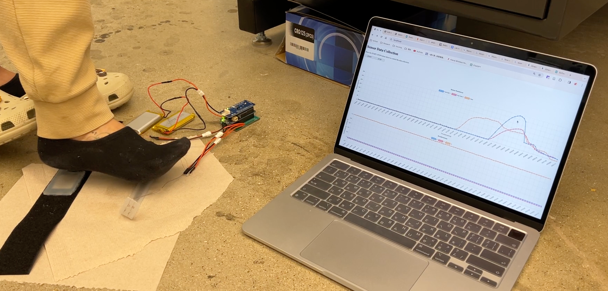
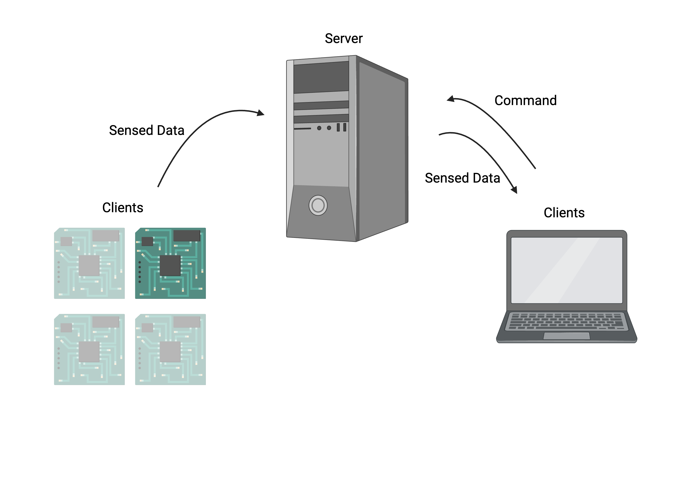

# Real-Time Wearable Sensing System

End-to-end wearable sensing prototype integrating pressure and IMU acquisition, wireless WebSocket communication, concurrent Node.js processing, and browser-based live visualization.



## System Overview

The system was designed to collect multi-channel foot-pressure and inertial data from wearable sensor nodes and stream them to a central server for storage, monitoring, and downstream analysis.



**Data flow**

`Pressure sensors + IMU → Arduino acquisition → Wi-Fi / WebSocket → Node.js server → local data storage + browser dashboard`

## What I Built

- Developed Arduino/C++ firmware for three pressure-sensor channels and IMU acquisition.
- Streamed timestamped sensor measurements over Wi-Fi using WebSocket communication.
- Built a concurrent Node.js server using the `cluster` module and multi-process workers for sensor connections and browser control.
- Implemented routing and storage for up to four sensor labels (`A1`–`A4`) using NeDB.
- Added browser-based START/STOP control and live pressure/acceleration visualization with Chart.js.
- Built supporting Python tooling for exporting stored measurements for offline analysis.

## Technical Highlights

### Embedded sensing

The Arduino firmware reads three analog pressure channels and IMU acceleration data, converts the pressure measurements to resistance values, timestamps each sample, and sends the resulting message through a WebSocket connection. The firmware uses a 10 ms loop delay; this repository does not claim a measured end-to-end latency or guaranteed sampling rate.

### Concurrent server

`server/server.js` uses Node.js `cluster` to fork worker processes based on available CPU cores. Browser START/STOP commands are broadcast from the primary process to the sensor workers using inter-process messaging. Sensor messages are forwarded back to the primary process and stored according to the `A1`–`A4` device label.

### Live dashboard

The browser dashboard uses Chart.js to display recent pressure and acceleration measurements and communicates with the server through WebSocket and HTTP endpoints.

## Technology

**Embedded:** Arduino/C++, WiFiNINA, MKR IMU  
**Backend:** Node.js, Express, WebSocket, NeDB  
**Frontend:** JavaScript, HTML/CSS 
**Data:** Python

## Repository Structure

```text
.
├── server/
│   └── server.js              # Multi-process WebSocket/data server
├── hosting_web_client/
│   ├── hosting_web_client.ino # Arduino pressure + IMU acquisition
│   └── arduino_secrets.example.h
├── public/
│   └── index.html             # Browser dashboard
├── DBtoCSV_xlxs.py            # Data export utility
├── assets/
│   ├── system_demo.jpg
│   └── system_architecture.jpg
├── package.json
└── .gitignore
```

## Running the Server

Install the Node.js dependencies:

```bash
npm install
```

Start the server:

```bash
npm start
```

The dashboard server listens on port `3002`, while sensor worker processes listen for Arduino WebSocket connections on port `80`.

## Arduino Configuration

Copy the example secrets file:

```text
hosting_web_client/arduino_secrets.example.h
```

to:

```text
hosting_web_client/arduino_secrets.h
```

and provide the local network credentials there. The real secrets file is intentionally ignored by Git and must never be committed.

The Arduino firmware also requires the server address to match the machine running the Node.js server.

## Project Context

This project was developed as a research prototype for wearable sensing and real-time data collection. The public repository is organized as an engineering portfolio artifact and focuses on the embedded-to-edge sensing pipeline.
